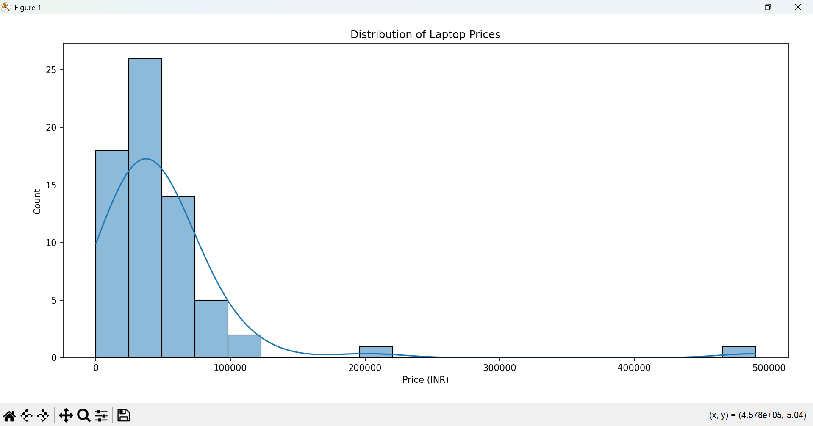
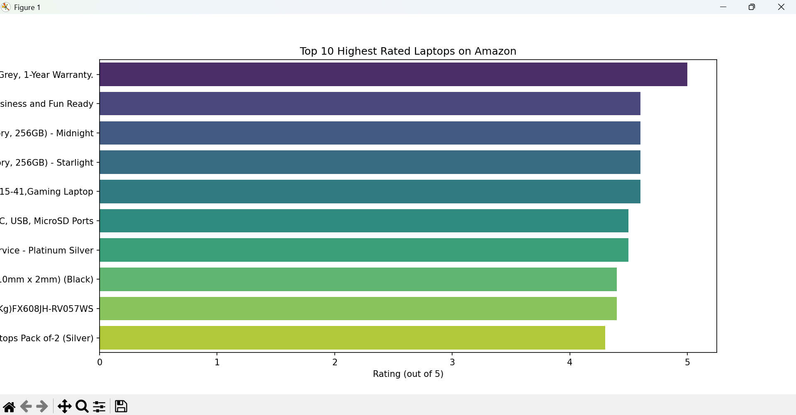
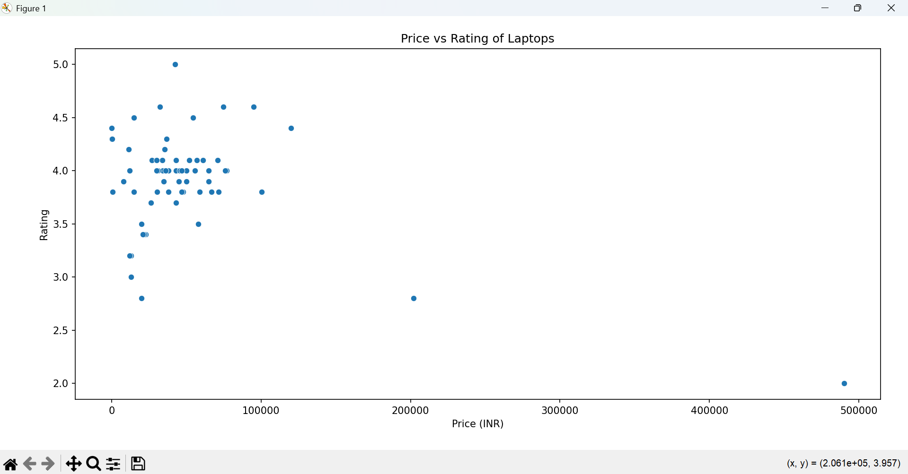

# CodeAlpha Data Analytics Internship Projects

This repository contains my completed tasks from the **CodeAlpha Data Analytics Internship**, demonstrating skills in **web scraping**, **data cleaning**, and **data visualization** using Python.

---

## 🧩 Task 1: Web Scraping
**Objective:** Extract product data (Name, Price, Rating) from Amazon using Python.

**Tools Used:** 
- BeautifulSoup
- Requests
- Pandas

**Highlights:**
- Scraped multiple pages of product listings
- Collected and structured product details into a CSV file

**Files:**
- `Task1_WebScraping/amazon_multiscrape.py`
- `amazon_products.csv`

---

## 📊 Task 3: Data Visualization
**Objective:** Visualize insights from scraped Amazon data.

**Tools Used:** 
- Matplotlib
- Seaborn
- Pandas

**Highlights:**
- Bar Chart – Top 10 highest-rated laptops
- Histogram – Price distribution
- Scatter Plot – Price vs Rating

**Files:**
- `Task3_DataVisualization/data_visualization_amazon.py`
- `visualization_output.png`

---

## 🚀 How to Run
1. Clone this repository:
   ```bash
   git clone https://github.com/YOUR-USERNAME/CodeAlpha_DataAnalytics.git
2. Navigate to the project folder:
   ```bash
   cd CodeAlpha_DataAnalytics
3. Install the required libraries:
   ```bash
   pip install requests beautifulsoup4 pandas matplotlib seaborn
4. Run Task 1 (Web Scraping):
   ```bash
   python Task1_WebScraping/web_scraping_amazon.py
5. Run Task 3 (Data Visualization):
   ```bash
   python Task3_DataVisualization/data_visualization_amazon.py


## 🧠 Skills Demonstrated 

- Web Scraping and Data Extraction
- Data Cleaning and Preprocessing
- Exploratory Data Analysis (EDA)
- Data Visualization and Storytelling
- Python for Data Analytics
- GitHub Project Documentation


## 🖼️ Project Visualizations

### 📊 Top 10 Highest Rated Laptops
This chart shows the highest-rated laptops on Amazon, based on user feedback.



### 💰 Price Distribution
The histogram shows how laptop prices are distributed, revealing common pricing ranges.



### ⭐ Price vs Rating
The scatter plot compares laptop prices with their ratings to identify whether higher prices mean better reviews.




## 🌐 Connect with Me

👨‍💻 Name: Abhay Pratap
🔗 LinkedIn: `https://www.linkedin.com/in/abhay-pratap-a50570368/?original_referer=`
🐙 GitHub: `https://github.com/CodeIt-Abhay`


## 🏁 About the Internship

This project is part of the Data Analytics Internship by CodeAlpha
 — designed to help students gain real-world experience in data-driven problem-solving and analytics.
